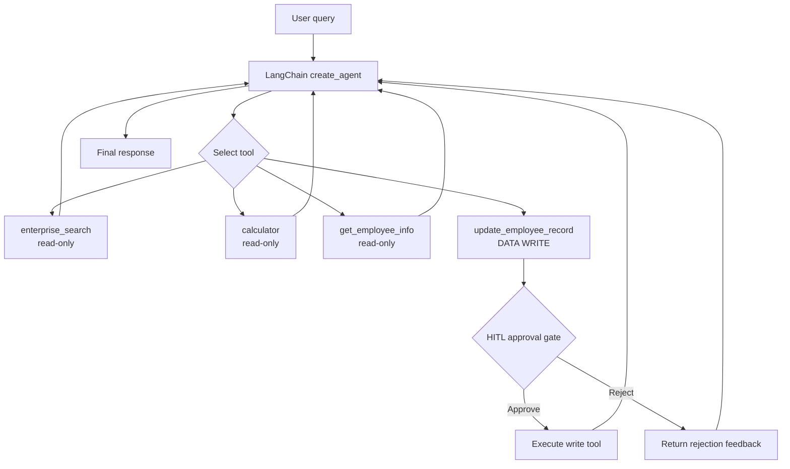

# Week 4 — Human-in-the-Loop Flow

## Approval policy

| Tool | Risk | Approval |
|---|---|---|
| `enterprise_search` | Read-only retrieval | No |
| `calculator` | Read-only computation | No |
| `get_employee_info` | Read-only internal lookup | No |
| `update_employee_record` | Data write | **Yes** |

The approval middleware pauses the graph before the write tool executes. The graph is
checkpointed so it can resume with an `approve` or `reject` decision.
